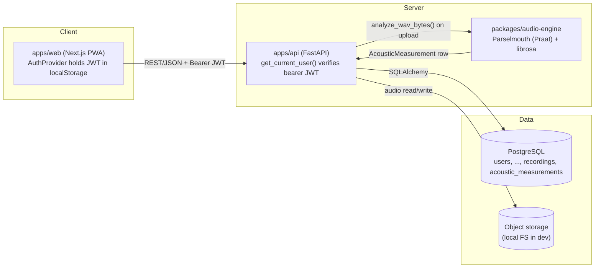

# VepAIr Architecture

Status: Stage 11 (Progress Dashboard) shipped and live; Stage 12 Phase II (VepAIr Coach pilot)
built on the `feature/coach-portal` branch, dev-only, not yet merged or deployed — see §6m. This
document describes the system as it exists after Stage 11 plus that in-progress branch, and the
intended shape it grows into. Update this file whenever architecture changes.

## 1. Repository structure

Monorepo, as specified by the product brief, with one deviation documented below.

```
/vepair
  /apps
    /web              Next.js (TypeScript) frontend — PWA
    /api              FastAPI (Python) backend
  /packages
    /audio-engine      Python DSP package (Stage 3) — pitch, jitter, shimmer, HNR, etc.
    /shared-types      Types shared between web and api (OpenAPI-generated + hand-written)
    /ui                Shared React component library (Tailwind-based)
  /docs                Per-metric documentation (acoustic-measurements.md, golden-voice-set.md)
  /tests
    /unit
    /integration
    /e2e
  /scripts             Dev setup / migration / fixture scripts
  /data
    /fixtures           Synthetic audio fixtures ("Golden Voice Set", Stage 3)
  README.md
  ARCHITECTURE.md
  TESTING.md
  CHANGELOG.md
  ROADMAP.md
  MEDICAL_SAFETY.md
  PRIVACY.md
```

**Deviation from the suggested structure:** `packages/audio-engine` is a Python package (not
JS/TS) because the DSP stack (librosa/scipy/numpy/Parselmouth) is Python-only. It is consumed by
`apps/api` as a local editable dependency rather than published to npm. This keeps a single
language boundary: TypeScript on the frontend, Python for everything audio/data.

## 2. Tech stack

| Layer | Choice | Why |
|---|---|---|
| Frontend | Next.js 16 (App Router) + React 19 + TypeScript (strict) | SSR/PWA support, file-based routing, large ecosystem. `create-next-app` installed the current major (16.3.0/19.2.8) at scaffold time rather than the "14" originally sketched — App Router fundamentals are unchanged; see `apps/web/AGENTS.md` for version-specific API notes |
| Styling | Tailwind CSS | Matches "WHOOP meets Spotify" premium-dark UX direction, fast iteration |
| Backend | Python 3.12 + FastAPI | Typed, async, auto-generated OpenAPI schema consumed by frontend, native fit for the Python DSP stack |
| Validation | Pydantic v2 | Typed request/response models, shared source of truth for OpenAPI |
| Database | PostgreSQL 17 | Relational integrity for longitudinal per-user time-series data; strong JSON + window-function support for rolling baselines later |
| Migrations | Alembic | Standard for SQLAlchemy/FastAPI stacks, reversible migrations |
| ORM | SQLAlchemy 2.0 (typed) | Maps cleanly to Alembic, works with async FastAPI |
| Auth (MVP) | Self-hosted email/password (bcrypt + JWT), see section 6a | **Deviation from the Stage 0 plan** — Supabase requires creating an external account, which needs the founder's own signup, not something done on his behalf. Built to swap to Supabase Auth later with minimal blast radius. |
| Audio DSP | librosa, scipy, numpy, Parselmouth (Praat bindings), soundfile — `packages/audio-engine` | Industry-standard, well-validated acoustic analysis libraries. Parselmouth (Praat) for F0/jitter/shimmer/HNR — the field-standard tool for exactly those measurements; librosa for spectral features. See section 6c and `docs/acoustic-measurements.md`. |
| Object storage | Local filesystem in dev (`apps/api/var/recordings`), pluggable interface for S3-compatible storage in production | Keeps Stage 0/1 dependency-free while the storage interface is production-shaped from day one |
| Containerization | Docker Compose (Postgres + api + web) | Reproducible local dev; documented, not required to run locally |

Nothing here is final — later stages may revisit choices, but any change must be documented in
this file with a rationale, per the "never silently replace major technology choices" rule.

## 3. Environments

- **Local dev**: Postgres running natively (installed via the OS package manager) or via Docker
  Compose (`docker compose up db`), FastAPI via `uvicorn --reload`, Next.js via `next dev`.
- **Env vars**: never hard-coded. See `apps/api/.env.example` and `apps/web/.env.example`.

## 4. Data model

All entities below exist as SQLAlchemy models + Alembic migrations as of Stage 0. As of Stage 8,
`User`, `AuthCredential`, `RefreshToken`, `PasswordResetToken`, `UserProfile`, `DailyCheckIn`,
`VoiceSession`, `Recording`, `DeviceMetadata`, `AcousticMeasurement`, `Baseline`,
`RecoveryScore`, `Exercise`, `ExerciseSession`, `ExerciseResult`, and `VocalRange` are exercised
by working, tested endpoints; the rest of the schema still exists so later stages build on a
reviewed foundation instead of bolting on tables stage by stage.

- **User** — authentication identity (mirrors Supabase Auth user id).
- **AuthCredential**, **RefreshToken**, **PasswordResetToken** — Stage 1 self-hosted auth
  tables. See section 6a.
- **UserProfile** — onboarding answers: voice use, singer/non-singer, style, practice frequency,
  perceived range, goals, vocal coaching history, whether currently under professional care. No
  medical diagnosis fields.
- **VoiceProfile** — the evolving personalized model of one user's voice (current baseline
  pointer, confidence, range summary).
- **VoiceSession** — one guided recording session (Stage 2's "sustained Ah/Ee/Oo, hum, glide,
  sentence, optional song").
- **Recording** — one raw audio asset within a session, plus capture metadata (device, mic,
  sample rate). Original files are never destructively overwritten.
- **AcousticMeasurement** — DSP output for one recording (F0 mean/median/min/max, pitch
  stability, jitter, shimmer, HNR, RMS loudness, spectral centroid/rolloff, zero-crossing rate,
  voiced ratio, longest voiced run (Stage 10) — see `docs/acoustic-measurements.md`). Computed
  automatically on upload by `packages/audio-engine`, section 6c.
- **DailyCheckIn** — subjective daily journal entry (voice quality, fatigue, discomfort, sleep,
  hydration, load, optional reflux/smoke exposure, notes). All fields skippable.
- **Exercise** (Stage 6) — library entry (name, category, purpose, instructions, duration,
  difficulty, audio demo placeholder, contraindications, target measurement, expected result).
  Seeded from `app/exercise_library.py` — see section 6f.
- **ExerciseSession** (Stage 6) — one instance of a user doing a routine.
- **ExerciseResult** (Stage 6) — measured/self-reported outcome of one exercise within a
  session.
- **Baseline** (Stage 4) — a computed personal baseline snapshot (median, MAD, sample count,
  confidence, window) for one `(user, metric)` pair. One row per metric, updated in place as new
  usable sessions arrive (unique constraint on `user_id, metric_name`) — not a growing history
  table. See section 6d.
- **VocalRange** (Stage 8) — comfortable low/high/falsetto note history, one row per test
  attempt (a growing ledger, not upserted in place like `Baseline`/`RecoveryScore`).
  `source_recording_id` links back to whichever underlying `Recording` contributed to that row.
- **VocalPlan** (Stage 9) — a 90-day repair/improvement plan. One row per plan; past plans are
  superseded, not deleted. `baseline_snapshot` freezes the real measurements the plan was
  generated from; `target_milestones` holds the goal. `UserProfile.track`
  (`"repair" | "improvement" | null`) drives which plan is active. See section 6j.
- **Recommendation** — a generated suggestion (exercise, routine, load adjustment) with the
  inputs that produced it, so recommendations stay explainable.
- **RecoveryScore** (Stage 5) — the daily 0-100 VepAIr Score. One row per `(user, score_date)`
  (unique constraint), recomputed and upserted fresh on every read rather than write-triggered
  like `Baseline` — see section 6e for why. `components` stores the full breakdown (per-metric
  scores, weights, inclusion) as JSON, the same data the "why did I get this score?" UI reads.
- **DeviceMetadata** — recording device/microphone fingerprint, reused across sessions.
- **ConsentRecord** — explicit, timestamped consent grants, separated by purpose (product
  analytics, model training, coach sharing, notifications) per `PRIVACY.md`. An append-only
  ledger, not upserted in place — every change of mind inserts a new row rather than overwriting
  the last one. Exercised via `GET`/`PUT /api/v1/consent/{consent_type}` (notifications) and
  `app/routers/coach_access.py` (coach sharing); `product_analytics`/`model_training` are
  validated by the consent endpoint but have no UI yet.
- **CoachProfile**, **CoachInvite**, **CoachAccess**, **CoachAccessCategoryGrant**,
  **CoachAssignment**, **CoachNote** (Stage 12 Phase II, dev-only build — see §6m) — the VepAIr
  Coach pilot's authorization and data-sharing subsystem. Built on `feature/coach-portal`, not
  merged to `main` or deployed as of this writing.
- **VocalGoal** (post-Stage-12) — a singer's target low/avg/high note. Current-state, not
  history: one row per user, upserted in place — see §6n.

See `apps/api/migrations/versions/` for the actual column-level schema and
`apps/api/app/models.py` for the SQLAlchemy definitions — this document intentionally does not
duplicate column lists that will drift from the real schema.

## 5. System diagram



Stage 0 planned a separate Supabase Auth box here; Stage 1's self-hosted auth (section 6a) folds
authentication into the API itself, so there's no third auth service in this diagram for now.

## 6. API design conventions

- All endpoints versioned under `/api/v1`.
- Every request/response is a Pydantic model — no untyped dicts crossing the API boundary.
- `GET /api/v1/health` — liveness + DB connectivity check, no auth required. This is the Stage 0
  proof that frontend, backend, and database are wired together correctly.
- Errors follow a single `{"error": {"code": str, "message": str}}` shape, including
  `HTTPException`s raised anywhere in the app (`apps/api/app/main.py`'s exception handler
  normalizes them) and Pydantic validation failures (422).
- Auth: bearer JWT in the `Authorization` header, verified on every non-health, non-auth
  request via `get_current_user` (`apps/api/app/auth.py`).

## 6a. Authentication (Stage 1)

Stage 0 planned Supabase Auth. Stage 1 ships **self-hosted email/password auth** instead — see
the tech stack table above for why — designed so the eventual Supabase migration only touches
one module.

**Tables** (`apps/api/app/models.py`): `AuthCredential` (bcrypt password hash, 1:1 with `User`),
`RefreshToken` (hashed opaque token, revocable, rotated on every refresh), `PasswordResetToken`
(hashed, single-use, time-limited). All three are additive to `User` and deliberately hold no
data any other table references — dropping them later is a clean removal, not a migration.

**Tokens:**
- **Access token**: JWT (HS256, `JWT_SECRET` env var), 15-minute expiry, carries `sub` = user
  id. Verified in `verify_access_token()` (`apps/api/app/auth.py`) — **this one function is the
  entire Supabase swap point**: replace it with Supabase JWT/JWKS verification and
  `get_current_user` keeps working unchanged, since every route depends on `get_current_user`,
  never on the token format directly.
- **Refresh token**: an opaque random token (not a JWT), 30-day expiry, stored server-side only
  as a SHA-256 hash (`RefreshToken.token_hash`). Rotated on every use — the old token is revoked
  the moment a new one is issued, so a stolen, already-used refresh token is a dead end.
- **Password reset token**: same opaque/hashed/single-use pattern, 60-minute expiry. No email
  provider is wired up yet (`apps/api/app/email.py` logs the token instead of sending it) — see
  Recommended changes before Stage 2.

**Frontend session handling** (`apps/web/src/lib/auth-context.tsx`): tokens live in
`localStorage` (not an httpOnly cookie) and are attached as `Authorization: Bearer` headers by a
single `apiFetch()` helper, which transparently retries once after a silent refresh on a 401,
and force-logs-out to `/login` if the refresh itself fails. This was a deliberate simplification
for Stage 1 — see Recommended changes before Stage 2 for the cookie-based upgrade path.

**Never logged or exposed:** password hashes, raw refresh tokens, raw reset tokens (only their
hashes are stored/logged anywhere).

## 6b. Voice recording (Stage 2)

**Capture format — real WAV, not MediaRecorder webm/opus.** `apps/web/src/lib/recorder.ts`
captures raw PCM via `getUserMedia` + `AudioContext`/`ScriptProcessorNode` and encodes 16-bit
WAV in-browser, rather than using the more common `MediaRecorder` API (which outputs compressed
webm/opus). Stage 3's DSP work (librosa, Parselmouth, soundfile) needs precise, uncompressed
samples, so it's better to produce WAV from the start than re-encode later. `ScriptProcessorNode`
is deprecated but still functional in every current browser; migrating to `AudioWorkletNode` is
listed as technical debt below.

**Storage** (`apps/api/app/storage.py`): a narrow `save`/`read`/`exists`/`delete`-by-key
interface, currently backed by the local filesystem (`STORAGE_BACKEND=local`,
`apps/api/var/recordings/<user_id>/<recording_id>.wav`). Recording keys are always
`<uuid>/<uuid>.wav`, never derived from user input, so there's no path-traversal surface. A
future S3-compatible backend is meant to be a drop-in swap behind the same interface — not yet
built, since Stage 2 doesn't need it.

**Quality gating** (`apps/api/app/audio_quality.py`): stdlib-only (`wave` + `array`) — the real
acoustic-analysis stack (numpy/scipy/librosa/Parselmouth) is intentionally deferred to Stage 3.
Every upload is analyzed server-side (never trusting the client-side check alone) for:

- **Clipping** — fraction of samples pinned near full scale.
- **Too quiet** — RMS below a floor.
- **Too short** — duration below a minimum.
- **Possible background noise** — a coarse floor-vs-peak energy ratio across short windows, gated
  by a coefficient-of-variation check so it doesn't fire on continuous phonation (sustained
  vowels/hum/glide have no natural pauses to compare against — see `TESTING.md` Stage 2 bugs for
  the false-positive this caused before the gate was added). This is a heuristic gate for
  obviously-bad recordings, not a validated SNR measurement — see the distinction between
  *recording* quality and *voice* quality in `MEDICAL_SAFETY.md`.

Flags are advisory, not blocking: the frontend shows a warning with a prominent "Retake" option
but still lets the user upload a flagged recording ("Use this take"), since the heuristics can be
wrong and the user's own judgment should win.

**Not yet implemented:** deleting a `Recording` cascades the DB row (via `ON DELETE CASCADE` from
`VoiceSession`/`User`) but does **not** yet delete the underlying file from storage — there is no
delete endpoint at all yet, only create/read. `PRIVACY.md`'s recording-deletion requirement isn't
satisfied until that lands.

## 6c. Acoustic analysis engine (Stage 3)

**`packages/audio-engine`** (`vepair-audio-engine`, installed editable into `apps/api`'s venv —
see `scripts/setup.ps1`) is a standalone Python package, deliberately separate from `apps/api`
so it stays independently testable and could in principle be reused outside the API later.

**Library choices, and why:**
- **Parselmouth** (Python bindings to Praat) computes F0 (mean/median/percentile-based
  min/max), pitch stability, jitter, shimmer, and HNR — Praat is the field-standard tool for
  exactly these voice-science measurements, not a homebrew reimplementation.
- **librosa** computes spectral centroid, spectral rolloff, and zero-crossing rate — the
  standard Python library for generic spectral features.
- **numpy/scipy** for the underlying array math; **soundfile** for WAV decoding.

Full per-metric documentation (definition, algorithm, units, valid input type, limitations,
expected variability) lives in **`docs/acoustic-measurements.md`** — required reading before
changing any measurement's implementation.

**Per-sample-type validity.** Jitter, shimmer, and HNR are only computed for sustained
phonation (`sustained_ah`/`ee`/`oo`/`hum`) — they're classically defined on a steady periodic
signal, and computing them on a glide (moving pitch) or running speech/song (mixed
voiced/unvoiced content) would produce a number that looks precise but isn't scientifically
valid. VepAIr returns `null` for those fields on other sample types rather than fabricate a
value — see `SUSTAINED_PHONATION_SAMPLE_TYPES` in `measurements.py`.

**Wired into the upload path, not a separate step.** `POST
/api/v1/voice-sessions/{id}/recordings` (Stage 2) now also runs
`vepair_audio_engine.measurements.analyze_wav_bytes()` on every upload and stores the result as
an `AcousticMeasurement` row, best-effort: a recording too short/silent to analyze simply gets
no measurement row (`measurement: null` in the API response) rather than failing the upload —
the recording itself is never blocked on whether it happens to be analyzable.

**Recording Quality Score** (`apps/api/app/audio_quality.py`, extended from Stage 2, *not* part
of `packages/audio-engine`): a 0-100 explainable score built only from Stage 2's
recording-technical signals (clipping, gain staging, duration, background-noise heuristic).
Deliberately never factors in `packages/audio-engine`'s voice measurements (jitter, shimmer,
HNR, F0) — a low score must always mean "re-record this, the capture was off," never "something
may be wrong with your voice." A unit test (`test_score_never_factors_in_voice_measurements`)
guards this boundary by inspecting the scoring function's source for forbidden terms.

**Golden Voice Set** (`data/fixtures/golden-voice-set/`, generated by
`packages/audio-engine/scripts/generate_golden_voice_set.py`): permanent, synthetic,
deterministic audio fixtures (stable/unstable/quiet/loud vowel, pitch glide, low/high note,
vibrato, breathy, noisy room, clipping, silence, instrument contamination) with regression
tests locking in current measurement behavior — see `docs/golden-voice-set.md`, including a
documented real finding (a pitch-tracker "missing fundamental" failure mode reproduced by the
`instrument_contamination` fixture).

## 6d. Personal vocal baseline (Stage 4)

**`apps/api/app/baseline.py`**: pure statistics functions (no DB access) plus a thin
DB-aware orchestration layer, kept in one module rather than split across `packages/` since
this logic is API-specific (it reads `AcousticMeasurement`/`Recording`/`DailyCheckIn` rows
directly) unlike the audio-engine DSP, which has no database dependency at all.

**Core idea, matching the product brief exactly:** every baseline compares a user only against
**their own voice over time** — never population norms, never other users. Nothing in this
module reads or aggregates across users.

**Robust statistics, not mean/stddev.** Baselines use median and median absolute deviation
(MAD) instead of mean/standard deviation, specifically so that a handful of bad recordings (a
phone left near a fan, one clipped take) can't drag the baseline around the way an outlier
drags a mean and inflates a stddev. Anomaly detection uses the **modified z-score** (Iglewicz &
Hoaglin's published method, `0.6745 * (x - median) / MAD`, threshold `|z| > 3.5`) — a standard
robust-statistics technique, not invented here.

**Anomaly detection never biases itself.** `analyze_and_update_baselines()` computes the
baseline from a user's *prior* sessions only (excluding the recording just uploaded), compares
the new value against that, and only afterward recomputes/stores the baseline including the new
recording. A new data point is judged against history, then joins it — it never gets to grade
its own exam.

**Confidence is a data-sufficiency indicator, not a statistical probability** — see
`MEDICAL_SAFETY.md`. Linear in usable-session count up to 14 ("established"): `insufficient`
(0-2), `building` (3-6), `developing` (7-13), `established` (14+).

**Metric scoping.** `VOICE_METRICS` (9 metrics from sustained-phonation recordings — F0
mean/min/max, pitch stability, jitter, shimmer, HNR, RMS loudness, duration) all share one
session-count-based confidence, since they come from the same recordings. `CHECKIN_METRICS`
(currently just `fatigue`, from `DailyCheckIn`) has its own separate confidence basis —
check-in consistency and recording consistency are different data streams and are never mixed.

**Zero-MAD edge case, handled explicitly, not accidentally.** If every prior value is
identical (MAD = 0), the modified z-score formula divides by zero. Handled as its own case: any
deviation at all is flagged as an anomaly (documented and tested —
`test_zero_mad_baseline_flags_any_deviation` in `apps/api/tests/unit/test_baseline.py`). This
shows up in practice with synthetic test audio (which has near-zero floating-point noise on
metrics like jitter/shimmer) but is the mathematically correct behavior for real data too: a
value that's never varied even slightly and then does is, definitionally, the most anomalous
possible case.

**Wired into the upload path, not a separate step.** `POST
/api/v1/voice-sessions/{id}/recordings` runs baseline analysis only for
`SUSTAINED_PHONATION_SAMPLE_TYPES` (comparing a glide's swept F0 or a sentence's mixed
voiced/unvoiced content against a sustained-vowel baseline would not be a meaningful
comparison), and only when an `AcousticMeasurement` was actually produced — a too-short/bad
recording that never got measured can't corrupt or shift the baseline. Any detected anomalies
are returned once, in that upload's response (`RecordingOut.anomalies`), and are not stored or
re-served — they're a one-time "was this notably different from your recent baseline" signal,
not a persistent record.

**`GET /api/v1/baseline`** (`apps/api/app/routers/baseline.py`) returns the current stored
snapshot: per-metric median/MAD/sample-count/confidence for all voice metrics, overall voice
confidence, usable session count, and the separate fatigue baseline. It reads the materialized
`Baseline` table (upserted on each qualifying upload, unique per `(user_id, metric_name)`), not
a live recomputation — so a baseline's `window_start`/`window_end` only advances on the next
upload after new data exists, matching the "one row per (user, metric), updated in place" model
described in `models.py`.

**Anomaly messages are deliberately vague, never diagnostic** ("Your average pitch is
noticeably different from your recent baseline") — see `MEDICAL_SAFETY.md`. No message ever
implies a direction is good or bad, or suggests a cause.

## 6e. VepAIr Daily Recovery Score (Stage 5)

**`apps/api/app/recovery_score.py`**: pure component-scoring and aggregation functions, plus a
thin DB-aware orchestration layer — same split as `baseline.py`, for the same reason (testable
math with zero DB dependency, kept separate from the query code that feeds it).

**"NOT a medical score. An individualized training/recovery indicator"** (the product brief's
own words). Every component is either an objective measurement compared to the user's own
history (never a population norm — reusing Stage 4's baseline/modified-z-score machinery
directly, via `app.baseline.detect_anomaly`), or a direct readout of a same-day self-report
field. Two components from the brief's "possible components" list are deliberately not
implemented: *Vocal Range* (needs Stage 8) and *Vocal Endurance* (nothing captures
within/across-session decline yet) — not fabricated, just absent, same principle as Stage 3's
deferred formants/CPP.

**"Recording Confidence" is the score's confidence label, not a weighted component.** Folding
"how much data do we have today" into the same weighted average as "how good is today" would
answer two different questions with one number. Instead it's `confidence_label`
(insufficient/low/moderate/high, from how many of the six implemented components had real data
today) shown next to the score — matching the brief's own worked example, "Score 72 /
Confidence: Moderate," as two separate numbers.

**Missing components regress toward neutral (50), never toward zero.** A naive weighted average
over only the available components would let a single self-report answer *become* the entire
score on a sparse day — exactly what broke an early version of this (see `TESTING.md` Stage 5
bugs: reporting only poor sleep, with nothing else filled in, incorrectly produced a "red"
recovery-focused day). Missing components now blend in at 50 (neutral) instead of being dropped
and renormalized; since the largest single component weight is 0.20, one bad self-report answer
can move the total at most 10 points from neutral. This is also what makes "bad microphone
recordings don't tank the score" true by construction: a too-short/unanalyzable recording simply
produces no `AcousticMeasurement`, so its components are absent (→ neutral), never scored low.

**Discomfort is a hard safety override, not a weighted factor.** `throat_discomfort >= 7` forces
`status = "red"` and a fixed safety message (from `MEDICAL_SAFETY.md`'s own escalation language)
regardless of every other component — a good acoustic day can never outvote it. This is checked
separately from, and after, the weighted score itself.

**GREEN / YELLOW / RED status** uses careful, non-clinical language throughout ("Normal
training" / "Reduced vocal load recommended" / "Recovery-focused day") and is paired with an
explicit "not medical clearance" disclaimer everywhere it's shown — see `MEDICAL_SAFETY.md`.

**"Why did I get this score?" is derived from the same data the score is computed from, not a
separate narrative path.** `build_factors()` reads directly off the per-component scores that
fed the weighted average; a unit test (`test_explanation_mathematically_matches_score`)
recomputes the total from exactly what the API response exposes and asserts it reproduces
`score_value`, proving the explanation can't drift out of sync with the number.

**Computed fresh on every `GET /api/v1/recovery-score?date=...` call, not write-triggered.**
Unlike `Baseline` (upserted from the recording-upload path), a day's score depends on two
independent write paths — check-ins and recordings — so recomputing on read is simpler and
always current, at the cost of doing the (cheap) aggregation math on every request rather than
caching it. The result is still upserted into `RecoveryScore` for a persisted history. Fully
deterministic: the pure `compute_recovery_score()` function takes the day's component scores and
`score_date` as explicit arguments and never reads the clock, so the same underlying rows always
produce the same score — verified directly (`test_same_input_always_produces_same_score`).

## 6f. Personalized daily exercises (Stage 6)

**`app/exercise_library.py`**: the 23-exercise library as plain Python data (`SEED_EXERCISES`),
not user-generated content — reviewable and diffable like code, matched into the `exercises` DB
table by name via the idempotent `scripts/seed_exercises.py`. Covers all 12 categories from the
product brief (Breathing, Gentle humming, Lip trill, Tongue trill, Resonant voice exercises,
SOVT, Straw phonation, Pitch glides, Gentle sirens, Range exploration, Vocal cooldown, Speaking
voice recovery). **No aggressive screaming/distortion techniques are included** — the brief is
explicit that these require "a qualified methodology and appropriate safeguards," neither of
which exists yet. Every exercise carries `audio_demo_url: None`, an explicit placeholder per the
brief ("audio demonstration placeholder"), not a missing feature.

**`app/exercise_routine.py`**: same pure-functions-plus-DB-orchestration split as
`baseline.py`/`recovery_score.py`. Each category is tagged with an intensity tier
(low/moderate/high in `CATEGORY_INTENSITY`) — a coarse, defensible ordering (SOVT/breathing/
humming/cooldown are standard "safe most days" techniques; pitch glides and range exploration
deliberately push toward the edges of comfortable range) used to filter what's safe to include.

**The one rule that can never be overridden, per the brief verbatim ("never instruct someone to
'push through it'")**: `throat_discomfort >= 7` forces the lowest intensity tier and a fixed
safety message (reusing Stage 5's `SAFETY_MESSAGE`), checked first, before every other signal —
the same hard-override pattern as Stage 5's recovery-score discomfort rule. No combination of
good signals elsewhere can unlock a more demanding routine on a high-discomfort day.

**Every other signal independently proposes a caution level; the routine uses the strictest of
everything that fired.** Recovery status, high fatigue, heavy load stacked with fatigue (an
explicit "dangerous combination" from the brief's own test plan), poor sleep, a long gap since
the last routine, and today's baseline deviation (reusing Stage 5's `RecoveryScoreResult`
components directly — "is today's recording notably different from my normal?" is exactly the
signal already computed there) each independently propose low/moderate/high; the final cap is
the *minimum* of everything proposed, and every proposal's reason is surfaced, not just the
binding one. A day can be held back for more than one reason at once.

**"User goal" adaptation is a small, explicit keyword tie-breaker, not NLP.** A handful of
literal substrings in `UserProfile.goals` (e.g. "range" → try range-exploration exercises
earlier) reorder which *allowed* categories are tried first — they never add a category the
safety cap has excluded. Documented as exactly what it is, not oversold.

**Deterministic bin-packing.** Exercises are selected in a fixed category order (gentlest
first), always opening with Breathing and closing with Vocal cooldown when the time budget
allows, with the closing exercise's duration reserved up front so it's never crowded out by
whatever filled the middle. Same inputs (exercise library + signals + requested length) always
produce the same routine.

**Session tracking** (`ExerciseSession`/`ExerciseResult`) mirrors the `VoiceSession`/`Recording`
pattern from Stage 2: start a session, log a result per exercise (completed/skipped, optional
self-reported difficulty), mark it complete. `days_since_last_exercise` (derived from the most
recent *completed* session) feeds directly back into the routine generator's "several rest
days" rule — a completed history changes what future routines look like.

## 6g. Live AI vocal coach (Stage 7)

**Real-time analysis runs entirely client-side, in-browser — not a backend round trip.** The
product brief calls for "Use Web Audio API and backend analysis where appropriate": Web Audio
for the live, low-latency loop (network latency alone would make round-tripping every audio
chunk to the backend feel laggy and unresponsive), and "backend analysis" is what Stage 3
already does — the precise, archival Parselmouth/librosa measurement of the finished recording.
Stage 7 doesn't add a new backend analysis path; it adds a second, much cheaper, real-time one
that only needs to answer "roughly what's happening right now," not produce publication-grade
acoustic measurements.

**`apps/web/src/lib/pitchDetector.ts`**: a pure, dependency-free normalized-autocorrelation
pitch detector — deliberately simple (not ML-based) since live coaching only needs "roughly
what note is this," not Stage 3's archival precision. Returns `null` for silence, noise, or an
estimate below its confidence threshold, never a fabricated pitch. Unit-tested against known
synthetic frequencies (110/220/440Hz) the same way Stage 3's Golden Voice Set validates the
backend DSP — see `pitchDetector.test.ts`.

**A real bug worth recording**: the first implementation picked the single highest-correlation
lag across the whole search range, which is a classic autocorrelation trap — a pure tone
correlates just as strongly at 2x, 3x, ... its true period as at the true period itself, so the
naive "global max" approach locked onto an octave-down subharmonic almost every time. Fixed by
walking from the shortest lag (highest frequency) upward and taking the first strong local peak
instead of the global max — the standard fix for this exact failure mode.

**`apps/web/src/lib/feedbackEngine.ts`**: pure, deterministic rules mapping a rolling window of
`{pitchHz, rms, timestampMs}` samples to at most one feedback message at a time. Rules, in
priority order: comfortable-range (glide exercises only, checked against the user's *own*
Stage 4 baseline, never a population norm — if no baseline exists yet, this rule simply never
fires), gentle-onset (checked once per exercise attempt), volume-spike (latest RMS vs. a
rolling baseline), pitch-drift-near-end (sustained exercises only, first-half vs. second-half
mean pitch in semitones), and positive reinforcement for a sustained steady tone. Every rule is
independently unit-tested with synthetic sample sequences, including an explicit "false
feedback frequency" check: a clean, gently-onset, steady synthetic tone never produces a single
corrective message across the whole test suite.

**A configurable minimum interval between any two messages** (`FeedbackContext.minIntervalMs`,
exposed in the UI as Frequent/Normal/Minimal) is the direct implementation of both "avoid
overwhelming the user" and "create configurable feedback frequency" from the product brief —
one knob satisfies both requirements at once.

**`apps/web/src/lib/liveCoach.ts`**: the thin Web Audio integration layer. Reuses Stage 2's
`AudioRecorder` (already handles microphone permission and Web Audio setup) rather than
duplicating it — `LiveCoachSession` hooks `AudioRecorder.onChunk` to run `detectPitch` +
`feedbackEngine.processSample` on every audio chunk (~90ms cadence), and discards the recording
itself at the end (`stop()` never uploads or stores exercise audio — analysis is 100%
in-browser). Tracks per-frame analysis latency and voiced-frame ratio for an honest, measured
report (see `TESTING.md` Stage 7) rather than an assumed one.

**Which exercises get live coaching, and what kind, is derived from the Stage 6 category**, not
a separate config: `coachingProfileForCategory()` maps Breathing to `"none"` (no vocal signal to
analyze), Pitch glides/Gentle sirens/Range exploration to `"glide"` (range + smoothness focus),
and everything else to `"sustained"` (steadiness + onset + drift focus).

**Microphone denial degrades gracefully, never blocks the exercise.** If permission is denied or
no microphone exists, the exercise flow continues exactly as it did before Stage 7 (Stage 6's
manual mark-done/skip flow), with a small notice instead of live feedback — permission is only
requested once per session, not re-prompted per exercise.

**Optional per-exercise telemetry** (`voiced_ratio`, `frame_count`,
`average_analysis_latency_ms`) is stored in the existing `ExerciseResult.measured_result` JSON
column when a coached exercise completes — the field Stage 0's schema already reserved for
exactly this ("measured/self-reported outcome of one exercise"). Omitted entirely for
Breathing exercises or when coaching wasn't available, never a fabricated zero.

## 6h. Vocal range mapping (Stage 8)

**`app/vocal_range.py`**: Hz-to-note-name conversion, quality/duration gating, and historical
change computation — pure functions plus a thin DB-aware orchestration layer, the same split
used throughout the app (`baseline.py`, `recovery_score.py`, `exercise_routine.py`).

**Reuses the existing Stage 2/3 recording pipeline rather than building a parallel one.** Range
tests go through the ordinary `POST /api/v1/voice-sessions/{id}/recordings` upload with three
new sample types (`range_low`, `range_high`, `range_falsetto`), get the same Parselmouth
analysis every other recording gets, and are deliberately **excluded** from
`SUSTAINED_PHONATION_SAMPLE_TYPES` — a deliberately-tested extreme note shouldn't be folded into
Stage 4's personal baseline, which represents normal day-to-day variation, not the edges of
someone's range.

**A real bug this stage found and fixed, not just in this stage's own code**: a falsetto test at
660Hz was tracked as its own octave-down subharmonic (330Hz) because Stage 3's Parselmouth pitch
ceiling had been hardcoded to 600Hz — accurate for typical speaking/singing pitch but too low
for genuine falsetto/head voice, which this stage is the first to actually exercise. Fixed by
raising `F0_CEILING_HZ` to 1000Hz in `packages/audio-engine`; see `CHANGELOG.md` Stage 8 and
`docs/acoustic-measurements.md`.

**"Do not pretend microphone analysis alone can definitively classify vocal registers"** (the
brief, verbatim) — there is no chest/mix/head-voice register-classification code anywhere in
this module. Only comfortable low note, comfortable high note, and falsetto/head-voice note are
tracked, each independently, never combined into a claimed voice "type."

**`VocalRange` is a growing historical ledger**, not upserted in place like `Baseline`/
`RecoveryScore` — every test attempt is its own row, since "30-day change" and "90-day change"
need to look back at what the range actually was at specific points in time, not just the
latest snapshot.

**The one adaptive-challenge feature here** (`suggest_stretch_target`): a gentle, always-optional
+1 semitone suggestion beyond the user's own historical best high note — never a population
target, never framed as a requirement, and suppressed outright by high discomfort, a red
recovery status, or a declining recent trend in the user's own range history. Directly
implements the brief's "do not encourage users to force extreme notes" as code, not just copy.

## 6i. Exercise trends and adaptive challenge (Stage 8)

Two explicit additions beyond the product brief's own Stage 8 spec, requested directly: (1)
exercises should be "listened to" and tracked for improvement, and (2) the system should
"challenge your voice" as it gets better — always subordinate to Stage 6's existing safety caps.

**`app/exercise_audio.py`**: analyzes an exercise attempt's audio using the same Stage 3 DSP
pipeline — not a second or different "AI" — and, per `PRIVACY.md`'s minimal-collection
principle, never writes it to storage at all. The bytes are analyzed in-memory during the
request and discarded; only the derived numbers persist in `ExerciseResult.measured_result`.
Only exercises with a `target_measurement` are ever analyzed — an exercise with no target has
nothing to trend, so uploading its audio would be pure cost with no benefit.

**`app/exercise_trends.py`**: reuses Stage 4's median-comparison approach one level up —
instead of comparing a baseline's history to itself, it compares a *specific exercise's* recent
attempts against its own earlier attempts, per metric, with a direction map (`jitter_percent`
lower-is-better, `hnr_db` higher-is-better, etc.) so "improving" always means the same thing a
voice-science reader would expect. Below `MIN_ATTEMPTS_FOR_TREND` attempts, an exercise simply
doesn't appear as a classified trend — never a guessed direction from too little data.

**Adaptive challenge in `app/exercise_routine.py`**: `RoutineSignals.trending_positive` (true
only when more of a user's own exercise trends are improving than declining) can only ever
apply on a day `intensity_cap` is already `"high"` — it reorders *which* already-allowed
exercises get picked (harder-difficulty-first instead of gentlest-first, and the whole middle
category order reversed so higher-intensity categories are reached sooner), it never unlocks a
category the existing safety rules would otherwise exclude. Every hard safety rule from Stage 6
— discomfort, red recovery status, heavy-load-plus-fatigue, several rest days — is checked and
can still cap the routine exactly as before; challenge mode is strictly additive on an
already-safe day, confirmed by tests that assert a positive trend never changes the outcome when
any safety rule is also active.

## 6j. Personalized vocal track & 90-day plan (Stage 9)

User-requested feature: choose a "Vocal Repair" or "Vocal Improvement" track once the app has
heard the user's voice, get a 90-day plan specific to that measured range, and auto-graduate
from Repair to Improvement once recent data looks consistently stable.

**`app/vocal_plan.py`** follows the same pure-functions-plus-DB-orchestration split as
`baseline.py`/`recovery_score.py`/`exercise_routine.py`. A `VocalPlan` deliberately never
becomes a second, competing scheduling engine — day-to-day exercise selection and range-stretch
suggestions still run entirely through the existing Stage 6/8 adaptive systems (section 6f,
6h); a plan only supplies the `track` those systems read (via `RoutineSignals.track` and
`suggest_stretch_target`'s `track` parameter) plus a long-term target captured once from real,
already-measured data.

**No new "assessment" recording flow.** `build_assessment_snapshot` reuses the most recent
existing sustained-phonation recording (Stage 2/3) and the most recent `VocalRange` entry
(Stage 8) — returns `None`, never a fabricated plan, if either is missing. This is what makes
"choose track before you have any data yet" work: `ensure_plan_exists` is called again after
every vocal-range submission, so the plan appears automatically the moment enough data exists.

**Two distinct plan-sync functions, deliberately not merged**, found necessary after a bug in
manual browser testing (see `CHANGELOG.md` Stage 9 "Fixed"): `ensure_plan_exists` is a no-op
whenever *any* active plan already exists, so an unrelated data submission can never restart
the 90-day clock; `sync_plan_to_track`, used only by `PATCH /api/v1/profile/track`, always
produces a plan matching the track just chosen, replacing a stale one from a different track —
because a deliberate manual switch *is* a strong enough signal to restart the clock.

**Graduation (`assess_graduation_readiness`)** checks three independent criteria — 14+ days of
≥70% non-red recovery status, personal baseline confidence at "developing"/"established", zero
declining exercise trends (reusing Stage 8's `compute_exercise_trends`) — and always returns
every criterion's pass/fail reason, the same "show your work" pattern as Stage 5's recovery
score. `get_active_plan` (the `GET /api/v1/vocal-plan` read path) auto-graduates a Repair plan
the moment every criterion passes: supersede the old plan, create a fresh Improvement plan from
current data, flip `UserProfile.track`. See `MEDICAL_SAFETY.md` section 9 for why this is never
described as "you are healed."

**Track only ever adjusts how readily existing safety-bounded behavior engages, never a safety
rule itself**: Repair suppresses Stage 8's adaptive challenge mode and its range-stretch
suggestion outright; Improvement engages challenge mode by default on an already-uncapped day
and allows a bigger (+2 instead of +1 semitone) stretch suggestion when the recent range trend
is genuinely improving. Every Stage 6 hard safety rule (discomfort, red recovery status,
heavy-load-plus-fatigue) is checked identically regardless of track — regression-tested to
confirm track can never weaken or bypass them.

## 6k. Share My Progress (Stage 10)

Two read-only, exportable 9:16 summary images — "Today's Voice" and "My Progress" — built
entirely from data the app already measures. **A strict presentation layer**: nothing here
computes a statistic that isn't already trusted elsewhere, and nothing here writes anything new
(the one existing exception, `compute_and_store_recovery_score`'s today's-row upsert, is
unchanged from Stage 5 — never called for a past date here, so a historical `RecoveryScore` row
is never recomputed or overwritten).

**`app/share_progress.py`** follows the same pure-functions-plus-DB-orchestration split as every
other stage. Every field is independently optional; a source with no real data behind it is
simply omitted from the response, never fabricated — the founder's own explicit accuracy
requirement, enforced structurally rather than by convention.

**Vocal Endurance** (`AcousticMeasurement.longest_voiced_run_seconds`) is a genuinely new
measurement, not just new presentation — the longest unbroken run of voiced frames in a
recording, computed in `packages/audio-engine` by scanning the same frame-level voicing array
already used for `voiced_ratio` (no new signal-processing algorithm). It's deliberately excluded
from `app/baseline.py`'s `VOICE_METRICS` — see that module's comment — because
`app/recovery_score.py` asserts every `VOICE_METRICS` entry is claimed by exactly one scoring
component, and Share My Progress must never change what the daily score computes. Its own
historical comparison is computed directly from `AcousticMeasurement` history instead.

**"Pitch Stability %" reuses the recovery score's `acoustic_stability` component** (already a
0-100 "how typical is this for you" score from `detect_anomaly`/`score_from_anomaly_results`),
rather than inventing a new percentage. For the "My Progress" page's historical START value, the
same scoring functions are re-run read-only against a past recording's raw values and the
*current* baseline — a legitimate retrospective comparison ("how typical was your first session,
by what we now know is typical for you") that never touches stored history.

**Comparison basis is decided per metric, not once for the whole page**: an established
personal `Baseline` if one exists for that metric, else the user's first valid recorded session,
else that metric is simply not comparable. Different metrics can have different real answers at
the same time — Vocal Endurance, having no baseline-table entry at all (see above), can never be
"established," even when other metrics are. If nothing at all is comparable yet, the response
reports a real valid-session count instead of a comparison, matching the founder's spec's
"BUILDING YOUR BASELINE" fallback.

**Frontend**: `TodayCard`/`ProgressCard` (`apps/web/src/components/share/`) render at the true
1080×1920 export target size; the on-screen preview is a CSS-scaled wrapper around the same,
unscaled DOM node, so `html-to-image`'s `toBlob` always captures true resolution. `navigator.
share` is used when the browser supports file sharing, with a plain download as the fallback.

## 6l. Progress Dashboard (Stage 11)

A single new `/progress` page filling the specific gaps a codebase survey found before
building — no long-range VepAIr Score chart existed anywhere, vocal-range history was fetched
but never rendered, and no training-consistency (streak) view existed at all. Everything else
(check-in trends, vocal plan status, per-exercise trend badges) already had a home and wasn't
duplicated here.

**`GET /api/v1/recovery-score/history`** is deliberately read-only: `fetch_score_history`
(`app/recovery_score.py`) only ever returns `RecoveryScore` rows that already exist for the
requested range, never computing or storing a score for a day that doesn't have one. This is
the same "never modify historical data" principle Stage 10 established — backfilling would mean
scoring an old day's raw measurements against *today's* baseline (Baseline rows are upserted in
place, not a historical ledger — see section 6d), which would silently produce a different
number than whatever's already shown elsewhere for that date. Gaps in the chart are real.

**`app/training_consistency.py`** follows the same pure-functions-plus-orchestration split as
every other stage. `compute_streaks` is pure and unit-tested against every edge case
(today-counts, "yesterday still counts before today is over," a gap in the middle, current never
exceeding longest). Streaks are always computed from the user's *entire* completed-session
history, independent of whatever date range the chart is currently displaying — only the
per-day grid used for the visual calendar is bounded to the requested range (and further capped
at `MAX_CONSISTENCY_DAYS` to keep an "all-time" request from building an unbounded response).

**Consolidated exercise trend list** needed no backend changes at all — `GET
/api/v1/exercise-trends` (Stage 8) already computed the full per-exercise trend list; it just
wasn't fully displayed anywhere until this page.

## 6m. VepAIr Coach pilot (Stage 12, Phase II — dev-only, not yet deployed)

**Built entirely on a dedicated branch (`feature/coach-portal`), never merged to `main` or
deployed, per explicit founder instruction** — see `ROADMAP.md`'s Stage 12 note. The migration
below has only ever run against local dev Postgres, never production Supabase. Everything in
this section describes what exists on that branch, verified via local `uvicorn --reload` +
`npm run dev`, the same pattern every prior stage used.

**The central new piece of infrastructure**: until this stage, nothing in the codebase let one
user read another user's data — `get_current_user` purely validates a JWT with zero role or
ownership concept, and every existing endpoint trusts `current_user.id` for all reads/writes.
`app/coach_auth.py` is the single seam every coach-reads-singer endpoint depends on:
`get_current_coach` (403 if the authenticated user has no `CoachProfile` row) and
`require_coach_access(category=...)` (a dependency factory resolving the active `CoachAccess`
row for `(coach, singer_user_id path param)`, 403 if none/revoked or if a specific category
isn't granted).

**A coach account is a coach account from creation, not an upgrade.** `POST
/api/v1/auth/coach-signup` creates `User` + `AuthCredential` + `CoachProfile` in one transaction,
mirroring `signup()`'s existing pattern exactly plus the extra row — resolved this way (over a
self-serve profile upgrade or founder-provisioned accounts) directly by the founder. This also
means one account can never be both a singer and a coach, by construction, not by a runtime
check.

**Authorization data model, deliberately split into two purposes** (see `PRIVACY.md` §6 for the
consent-ledger half): `CoachAccess`/`CoachAccessCategoryGrant` are the materialized "is this
currently allowed" tables every request-time check queries; `ConsentRecord` (extended with a
`category` column, `consent_type="coach_sharing"`, renamed from `clinician_sharing`) stays the
append-only audit ledger and is never read at request time — a timestamped event log is the
wrong structure to query on every API call. **One active coach per singer at a time** is enforced
with a real Postgres partial unique index (`Index("uq_one_active_coach_per_singer",
"singer_user_id", unique=True, postgresql_where=text("status = 'active'"))`), not just an
application-level check, so it holds under a race between two simultaneous invite-accepts too;
the accept endpoint's 409 check is the friendly error, the index is the actual guarantee.

**"One shared Voice Intelligence engine," enforced by construction, not by convention.** `GET
/api/v1/coach/singers/{id}/summary` calls the exact same functions the singer's own endpoints
already call — `compute_and_store_recovery_score`, `build_summary` (`app/vocal_range.py`),
`compute_exercise_trends`, `build_training_consistency`, `build_routine_for_user` — parameterized
by `singer_user_id` instead of `current_user.id`, and returns the exact same Pydantic response
schemas. None of these five functions had any internal dependency on `current_user`, so this
required zero changes to any of them. Regression-tested by asserting byte-identical JSON between
the singer's own endpoint and the coach's endpoint for the same user/date.

**Training assignment can never weaken or bypass an existing safety rule — the highest-risk
change in this stage.** `app/coach_assignment.py`'s `get_active_assigned_exercise_ids` returns
assigned exercise ids only when both the `CoachAssignment` and its linked `CoachAccess` are still
active. In `app/exercise_routine.py`'s `_select_exercises`, assigned exercises are tried via
`allowed_by_id.get(exercise_id)` — the exact same `allowed` list already filtered by
`INTENSITY_ORDER[CATEGORY_INTENSITY[e.category]] <= cap_rank` that every adaptively-chosen
exercise draws from. An assigned exercise that exceeds today's intensity cap is never even a
candidate, because it's filtered out by the same line that already governs everything else —
`_propose_intensity_caps` itself is never touched. `generate_routine`'s `reasons` list always
discloses whether an assignment was included or safety-excluded, never silently either way.
Six dedicated unit tests (`TestCoachAssignment`, including a direct "discomfort hard-override
cannot be bypassed by a coach assignment" case) guard this.

**Professional notes** (`CoachNote`) are coach-authored, singer-readable by default, immutable
(soft-delete only, never edited in place) — see `MEDICAL_SAFETY.md` §12 for the concrete
clinical-language mitigations (disclaimer, server-side blocklist that flags but never blocks a
save, 2000-char limit).

**Hardcoded, permanent exclusion regardless of any category grant**:
`DailyCheckIn.illness_symptoms`/`.reflux_symptoms`/`.notes` and `VoiceSession.notes` are never
read by any coach-facing endpoint — enforced by building `CoachVoiceSessionOut` explicitly
field-by-field (never via a `.model_validate()` shortcut that could accidentally pull in a new
column later) and locked in by a negative-content regression test.

**Authenticated recording playback** required a pattern not used elsewhere in the app: a plain
`<audio src="...">` can't carry an `Authorization` header, so the coach-side recordings page
fetches audio as a `Blob` via `fetch()` with a bearer token read from `localStorage`, converts it
to an object URL, and only does so lazily on a user-initiated "Play" click per recording — never
eagerly for a whole page of recordings.

## 6n. Goal Tones, rest days, and coach tooling extensions (post-Stage-12)

**Goal Tones** (`app/vocal_goals.py`) — a singer's target low/avg/high note. `VocalGoal` is
current-state, not history: one row per user, upserted in place, same pattern as `UserProfile`.
`GET /api/v1/vocal-goals` returns the manual override if one exists, else a live AI
recommendation recomputed from `vocal_range.build_summary()` on every call (never stale) —
low/high default to the user's own historical best measured range, avg to the semitone midpoint.
An active, not-yet-reached goal reaches into two places, both additively: `vocal_range.py`'s
`suggest_stretch_target`/`suggest_low_stretch_target` gain an optional goal note that only adds
context to the reason text (never changes the step size), and `exercise_routine.py`'s
`RoutineSignals.goal_high_note`/`goal_low_note` (populated only when the goal isn't reached yet)
bias `_select_exercises`'s category order toward Range exploration/Pitch glides — the same
mechanism as the existing goal-keyword boost, still fully bounded by `intensity_cap`.

**Rest day recommendations** (`exercise_routine.py`'s `_should_recommend_rest_day`) sit above the
existing discomfort-based intensity cap. `build_signals_for_user` was factored out of
`build_routine_for_user` specifically so `GET /api/v1/routine/rest-check` (used by the home page)
can compute the same signals without also selecting exercises. See `MEDICAL_SAFETY.md` §13.

**Coach-authored custom exercises** (`POST /api/v1/coach/exercises`) add `Exercise
.created_by_coach_id` (nullable FK to `coach_profiles.id`, null = seed exercise). No other schema
change — `is_active` already existed and defaults `True`, so a created exercise is a normal,
immediately-live `Exercise` row from every other endpoint's point of view. See `MEDICAL_SAFETY.md`
§13 for why `category` must be an existing whitelisted value, not free text.

**Coach per-exercise tone targets** extend `CoachAssignment` with a nullable
`exercise_tone_targets: dict[str, str]` JSON column, parallel to the existing `exercise_ids`
column. `app/coach_assignment.py`'s `get_active_assigned_exercise_tone_targets` mirrors
`get_active_assigned_exercise_ids`'s active-assignment-and-access gating; `generate_routine`
filters it down to whichever assigned exercises actually made it into today's routine before
returning it — purely informational, never touches selection.

**Tone Match average-pitch recorder** reuses the entire existing upload/measurement pipeline
under a new `sample_type: "tone_baseline"`, added to both `SAMPLE_TYPES`
(`app/schemas_recording.py`) and `SUSTAINED_PHONATION_SAMPLE_TYPES`
(`packages/audio-engine/src/vepair_audio_engine/measurements.py`) — the latter is what makes it
automatically feed Stage 4's personal baseline like any other everyday recording, with zero new
baseline logic.

**Coach home page parity**: `apps/web/src/app/page.tsx`'s `Home()` no longer redirects a coach
account to `/coach`; `Dashboard` takes an `isCoachView` prop that skips every singer-only fetch
(none of that data exists for a coach account) and renders a compact panel plus a link into the
Coach Portal instead, keeping the same page shell for both account types.

## 7. Error handling strategy

- Backend: a single FastAPI exception handler maps known exceptions (validation, not-found,
  auth, DSP-failure) to typed error responses; unexpected exceptions are logged with a
  correlation id and returned as a generic 500 without leaking internals.
- Frontend: a top-level React error boundary per route; API-call failures surface as inline UI
  state, not silent failures.

## 8. Logging strategy

- Backend uses structured (JSON) logging via Python's `logging` with a request-id field injected
  per request (FastAPI middleware). Log level controlled by `LOG_LEVEL` env var.
- No PII or audio content is ever logged. Recording/user identifiers are logged as opaque UUIDs.

## 9. Coding standards

- TypeScript: `strict: true`, no implicit `any`, ESLint + Prettier.
- Python: type hints required on all function signatures, `ruff` for lint, `black` for
  formatting, Pydantic for all I/O boundaries.
- Both stacks: one logical change per commit, tests colocated per the structure in `TESTING.md`.

## 10. Local development database (Stage 0 note)

The dev environment runs PostgreSQL as the standard Windows `postgresql-x64-17` service on the
default port 5432, with a dedicated `vepair` role/database (password auth, `scram-sha-256`).
Managing the Windows service and its auth config requires administrator rights; `scripts/setup.ps1`
triggers a one-time UAC-elevated helper (`scripts/_admin_setup_pg.ps1`) to create the role/database,
then everything else (migrations, running the app) works from a normal, non-elevated shell.
`docker-compose.yml` uses the same port 5432 for any environment that prefers Docker instead.

Earlier in Stage 0, before admin rights were available, dev Postgres ran as a separate
user-owned cluster on port 5433 to avoid needing admin rights at all. That workaround has been
retired now that the service can be managed properly; it's noted here only because you may see
references to port 5433 in early commit history.

## 11. Open questions / deferred decisions

- Production object storage provider (S3 vs. Supabase Storage vs. GCS) — deferred until Stage 2
  needs real uploads beyond local dev.
- Whether professional-facing data (vocal coach/studio access via VepAIr Coach, Stage 12 — see
  `ROADMAP.md`; information purposes only, never clinical, so no HIPAA scope is anticipated)
  needs a separate database or row-level security in the same Postgres instance — resolved for
  the Phase II pilot's scale: application-level authorization (`app/coach_auth.py`, §6m) in the
  same Postgres instance, no RLS or separate database. Worth revisiting only if Phase III+
  (paid, more coaches/singers) changes that calculus.
